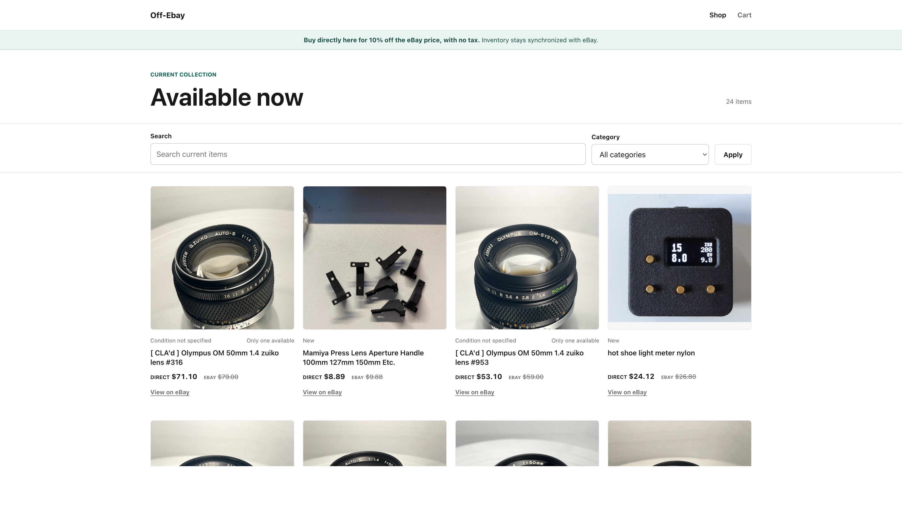
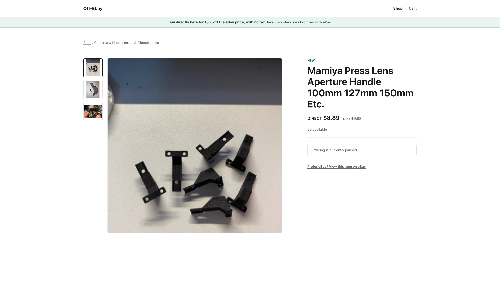
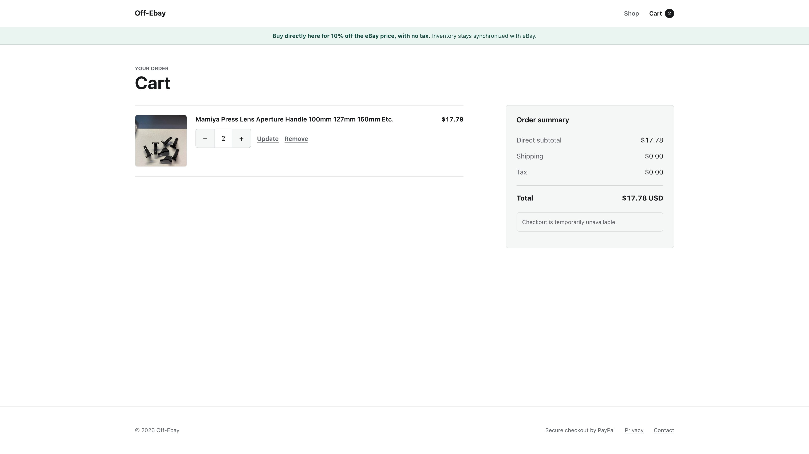
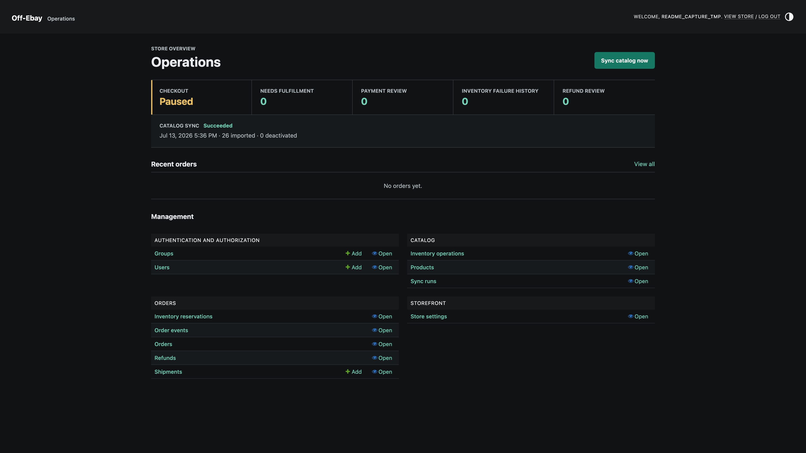

# Off-Ebay

Off-Ebay is a self-hosted direct storefront that synchronizes one seller's active eBay listings and stock, accepts guest checkout through PayPal, and imports Pirate Ship tracking through PayPal. Direct orders use a configurable discount, defaulting to 10% below the synchronized eBay price, and do not incur eBay marketplace fees.

The storefront is intentionally unlisted and sends `noindex` headers, but it is not access-controlled. Anyone with the URL can browse and place an order while checkout is enabled.

Off-Ebay is not affiliated with or endorsed by eBay, PayPal, Pirate Ship, or Cloudflare.

## What It Does

- Imports supported active fixed-price eBay listings, variations, descriptions, photos, condition, price, and available quantity.
- Shows the original eBay price, the configured direct price, and a link to the corresponding eBay listing.
- Rechecks the current eBay listing and reduces eBay inventory before PayPal captures payment.
- Uses server-calculated, immutable order totals; browser-submitted prices are never trusted.
- Accepts guest PayPal checkout for United States shipping addresses.
- Reconciles pending payments, refunds, expired reservations, and PayPal shipment tracking in a background worker.
- Lets Pirate Ship receive paid PayPal orders and lets tracking flow back through PayPal.
- Provides a private Django Admin dashboard for store availability, orders, refunds, fulfillment, sync health, and failures.
- Runs the application in one pinned Conda environment, both locally and inside Docker.

## Screenshots

The storefront images below use live synchronized product listings. The populated cart uses temporary session data, and the Admin capture contains no customer, order, or credential data. Every capture is 3840x2160; select an image to open it at full size.

| Catalog | Product detail |
| --- | --- |
| [](docs/screenshots/catalog.jpg) | [](docs/screenshots/product.jpg) |

| Populated cart | Admin operations |
| --- | --- |
| [](docs/screenshots/cart.jpg) | [](docs/screenshots/admin.jpg) |

## Architecture

| Service | Responsibility |
| --- | --- |
| `web` | Storefront, Admin, PayPal checkout, provider webhooks, health endpoint, migrations, and static files |
| `worker` | eBay catalog sync, inventory reconciliation, payment recovery, refund recovery, tracking import, and expired-session cleanup |
| `db` | PostgreSQL catalog, orders, reservations, provider references, and audit history |
| `proxy` | Optional Caddy HTTPS endpoint; do not start it when using Cloudflare Tunnel |

eBay remains the merchandising source of truth. Edit listing titles, descriptions, photos, source prices, variations, and quantities on eBay. Off-Ebay applies `DIRECT_DISCOUNT_PERCENT` to each synchronized eBay unit price, rounds to cents, and never overwrites the source price.

The application supports one configured eBay seller account per deployment. It is not a multi-vendor marketplace.

## Prerequisites

Production deployment requires:

- A Mac or Linux host that remains online.
- [Docker Desktop](https://docs.docker.com/desktop/) or Docker Engine with Docker Compose v2.
- A domain you control and one HTTPS path:
  - a [Cloudflare Tunnel](https://developers.cloudflare.com/cloudflare-one/connections/connect-networks/) for a domain managed by Cloudflare; or
  - public DNS, inbound ports 80/443, and the included Caddy service.
- An eBay seller account and an [eBay Developers Program](https://developer.ebay.com/) account with a Production keyset.
- A PayPal Business account. Live checkout requires a Live REST application and its Live credentials from the [PayPal Developer Dashboard](https://developer.paypal.com/dashboard/applications/live), not Sandbox credentials.
- A Pirate Ship account connected to the same PayPal account if automatic shipping import is wanted.
- A monitored support email address.
- `openssl` and `curl`, both included with macOS and most Linux distributions.

Conda is optional for production because the Docker image creates the standalone `seller-site` environment itself. Install Conda or Miniforge only for native development.

## Configuration Files

Docker Compose automatically reads `.env` from the repository root. Create it from `.env.example`:

```bash
umask 077
cp -n .env.example .env
chmod 600 .env
```

Native development uses `.env.local`, copied from `.env.local.example`. Django does not load either file itself. Compose loads `.env`; native commands require sourcing `.env.local` in each new terminal.

Both completed files are excluded by `.gitignore` and `.dockerignore`. Commit the example files, never the completed files.

### Production Variables

| Variable | Where it comes from |
| --- | --- |
| `DJANGO_SECRET_KEY` | A unique value from `openssl rand -hex 32` |
| `DJANGO_ALLOWED_HOSTS` | Your exact store hostname plus local health-check hosts, with no scheme or path |
| `DJANGO_CSRF_TRUSTED_ORIGINS` | Your exact public HTTPS origin, such as `https://store.example.net` |
| `STORE_NAME` | Customer-facing name; defaults to `Off-Ebay` |
| `DIRECT_DISCOUNT_PERCENT` | Direct discount from the synchronized eBay price; defaults to `10` and must be at least `0` and less than `100` |
| `SUPPORT_EMAIL` | A monitored customer-support inbox |
| `STORE_DOMAIN` | Your exact public hostname, such as `store.example.net`, with no scheme or path |
| `POSTGRES_PASSWORD` | A unique value from `openssl rand -hex 24`; choose it before the database volume is first created |
| `WEB_PORT` | Local host port for the web container; use `8001` if port 8000 is occupied |
| `EBAY_CLIENT_ID` | Production App ID/Client ID from the eBay keyset |
| `EBAY_CLIENT_SECRET` | Production Cert ID/Client Secret from the same keyset; the Dev ID is not used |
| `EBAY_REFRESH_TOKEN` | The `refresh_token` returned by eBay's Production OAuth authorization-code exchange |
| `EBAY_COMPATIBILITY_LEVEL` | Current Trading API version; the example currently uses `1455` |
| `EBAY_SELLER_USERNAME` | The exact eBay username authorized by the refresh token |
| `EBAY_MARKETPLACE_DELETION_VERIFICATION_TOKEN` | A 32-80 character token; `openssl rand -hex 24` produces a valid 48-character value |
| `EBAY_CHECKOUT_EXCLUDED_ITEMS` | Optional comma-separated eBay item IDs to hide from direct checkout; blank includes every supported item |
| `PAYPAL_CLIENT_ID` | Client ID from the live PayPal REST application |
| `PAYPAL_CLIENT_SECRET` | Secret from the same live PayPal REST application |
| `PAYPAL_WEBHOOK_ID` | ID of the live webhook registered for this store |
| `ORDER_RESERVATION_MINUTES` | Checkout inventory hold duration; defaults to `30` |
| `EBAY_SYNC_SECONDS` | Worker interval; defaults to `900` seconds |

Leave the live eBay and PayPal endpoint values exactly as provided in `.env.example`. Production validation rejects sandbox endpoints, example domains, wildcard hosts, weak secrets, incomplete credentials, and mixed provider environments.

Changing `.env` does not update an existing container. Recreate the affected services:

```bash
docker compose up -d --force-recreate web worker --wait
```

Do not change `POSTGRES_PASSWORD` after PostgreSQL has initialized unless you also rotate the database role password. Editing `.env` alone does not change the password stored inside PostgreSQL.

## Production Setup

The following sequence supports the eBay requirement that its account-deletion endpoint be public before a new Production keyset is activated.

### 1. Prepare the Repository and Secrets

```bash
git clone https://github.com/skysky2333/off_ebay.git
cd off_ebay
umask 077
cp -n .env.example .env
chmod 600 .env
openssl rand -hex 32
openssl rand -hex 24
openssl rand -hex 24
```

Put the first generated value in `DJANGO_SECRET_KEY`, the second in `POSTGRES_PASSWORD`, and the third in `EBAY_MARKETPLACE_DELETION_VERIFICATION_TOKEN`.

Set these domain values consistently:

```dotenv
DJANGO_ALLOWED_HOSTS=store.example.net,localhost,127.0.0.1
DJANGO_CSRF_TRUSTED_ORIGINS=https://store.example.net
STORE_NAME=Off-Ebay
DIRECT_DISCOUNT_PERCENT=10
SUPPORT_EMAIL=you@example.net
STORE_DOMAIN=store.example.net
WEB_PORT=8001
EBAY_SELLER_USERNAME=your-ebay-username
```

Use your real values. Production startup intentionally rejects `example.com`, `example.net`, and `example.org` hostnames.

### 2. Choose One HTTPS Deployment

#### Option A: Cloudflare Tunnel

Use this when the domain is managed by Cloudflare and the tunnel connector runs on the same host as Docker.

1. In Cloudflare Zero Trust, create or select a tunnel and install the connector using the command Cloudflare provides.
2. Add a public hostname for `STORE_DOMAIN`.
3. Set its service type to HTTP and origin to the local published port, for example `http://127.0.0.1:8001`.
4. Start only PostgreSQL and the web service:

```bash
docker compose up -d --build db web --wait
```

Do not start the Compose `proxy` service. Cloudflare supplies public HTTPS and forwards traffic through the tunnel. A connected tunnel returning `502` usually means the origin port is wrong or the `web` container is unhealthy.

#### Option B: Caddy

Use this when the host is directly reachable from the internet.

1. Point the hostname's public DNS records to the host.
2. Forward and allow inbound TCP ports 80 and 443, plus UDP 443 if HTTP/3 is wanted.
3. Ensure no other process is using those ports.
4. Start the included Caddy profile:

```bash
docker compose --profile tls up -d --build db web proxy --wait
```

Caddy obtains and renews the public certificate for `STORE_DOMAIN`.

### 3. Register the eBay Account-Deletion Endpoint

Generate a Production keyset on eBay's Application Keys page. The initial web service can run before the eBay client secret, refresh token, and PayPal credentials are installed.

Confirm the public endpoint first:

```bash
curl -i "https://YOUR_DOMAIN/webhooks/ebay/account-deletion/?challenge_code=test"
```

The response must be HTTP `200`, use `application/json`, and contain one 64-character `challengeResponse`.

In the Production keyset's **Alerts & Notifications** page:

1. Select **Marketplace Account Deletion**.
2. Save an alert email address.
3. Enter the exact endpoint, including its trailing slash:

   ```text
   https://YOUR_DOMAIN/webhooks/ebay/account-deletion/
   ```

4. Enter the exact value from `EBAY_MARKETPLACE_DELETION_VERIFICATION_TOKEN`.
5. Click **Save** and wait for eBay's challenge verification.

Do not select the data-persistence exemption: Off-Ebay stores synchronized eBay catalog data. General Platform Notification subscriptions are not required for this application.

See eBay's [Marketplace Account Deletion guide](https://www.developer.ebay.com/develop/guides-v2/marketplace-user-account-deletion) for the provider-side requirement.

### 4. Obtain the eBay OAuth Refresh Token

Use the Production App ID and Cert ID from the same keyset used above.

1. Open **User Tokens (eBay Sign-In)** for the Production keyset.
2. Create an OAuth-enabled redirect URL and note its **RuName**.
3. Use eBay's Production OAuth sign-in link to sign into the seller account named by `EBAY_SELLER_USERNAME` and grant access.
4. Exchange the returned one-time authorization code using the same Production App ID, Cert ID, and RuName. The request shape is:

```bash
curl --user "${EBAY_CLIENT_ID}:${EBAY_CLIENT_SECRET}" \
  --header "Content-Type: application/x-www-form-urlencoded" \
  --data-urlencode "grant_type=authorization_code" \
  --data-urlencode "code=${EBAY_AUTHORIZATION_CODE}" \
  --data-urlencode "redirect_uri=${EBAY_RUNAME}" \
  https://api.ebay.com/identity/v1/oauth2/token
```

Use `https://api.ebay.com/oauth/api_scope` when creating the authorization request. The `redirect_uri` sent to eBay is the RuName identifier, not the human-readable accepted URL.

Copy only the response's `refresh_token` value into `EBAY_REFRESH_TOKEN`. Do not use:

- the short-lived `access_token`, which normally lasts about two hours;
- an application token; or
- a legacy Auth'n'Auth token, commonly beginning with `v^1.1`.

Those token types produce `400` or `401` errors at the refresh-token endpoint. The authorization code is short-lived and single-use, and every credential must belong to the same Production keyset and seller authorization.

Follow eBay's [authorization-code grant](https://developer.ebay.com/api-docs/static/oauth-authorization-code-grant.html) and [refresh-token request](https://developer.ebay.com/api-docs/static/oauth-refresh-token-request.html) documentation for the provider flow.

### 5. Enable eBay Out-of-Stock Control

Sign into the real seller account, open [Selling preferences](https://www.ebay.com/mys/sellingpreferences), find **Multi-quantity listings**, and enable **Listings stay active when you're out of stock**.

Off-Ebay intentionally refuses to synchronize or sell until this setting is enabled because direct checkout must be able to reduce and later restore eBay inventory safely.

### 6. Configure PayPal

1. Create a live REST application in the PayPal Developer Dashboard.
2. Put its live client ID and secret in `PAYPAL_CLIENT_ID` and `PAYPAL_CLIENT_SECRET`.
3. Register this exact webhook URL:

   ```text
   https://YOUR_DOMAIN/webhooks/paypal/
   ```

4. Subscribe it to:
   - `CHECKOUT.ORDER.APPROVED`
   - `PAYMENT.CAPTURE.COMPLETED`
   - `PAYMENT.CAPTURE.PENDING`
   - `PAYMENT.CAPTURE.DECLINED`
   - `PAYMENT.CAPTURE.REFUNDED`
5. Put the resulting webhook ID in `PAYPAL_WEBHOOK_ID`.

All PayPal values must come from the same live application. See PayPal's [webhook documentation](https://developer.paypal.com/api/rest/webhooks/).

### 7. Connect Pirate Ship

Connect Pirate Ship to the same PayPal account used by Off-Ebay. No Pirate Ship API key is required.

Off-Ebay sends PayPal the order reference, recipient, shipping address, and item lines. The worker polls PayPal's order and shipping tracker resources so tracking added through Pirate Ship can appear on the customer's private order page. Tracking can also be entered manually in Admin.

### 8. Validate, Import, and Start Everything

After filling every remaining `.env` value, recreate the web container, validate the complete production configuration, run the first sync, and start the worker:

```bash
docker compose up -d --force-recreate web
docker compose exec web python manage.py validate_config
docker compose exec web python manage.py sync_ebay
docker compose up -d worker --wait
docker compose exec web python manage.py createsuperuser
docker compose ps
curl -fsS https://YOUR_DOMAIN/health/
```

There is no preset Admin username or password. `createsuperuser` prompts you to choose both; password input is intentionally invisible while typing.

If using Caddy, include `--profile tls` when bringing up the steady-state stack:

```bash
docker compose --profile tls up -d db web worker proxy --wait
```

## Open Checkout

Sign in at:

```text
https://YOUR_DOMAIN/admin/
```

Then:

1. Open **Store settings**.
2. Set **Flat shipping amount (USD)**. It is charged once per order.
3. Check **Checkout enabled** and save.

Checkout defaults to off. The storefront shows `Ordering is currently paused` until this switch is enabled and all eBay, PayPal, and support settings are present. Changing this Admin switch does not require a container restart.

## Acceptance Checklist

Before sharing the store URL, verify:

```bash
docker compose ps
docker compose exec web python manage.py validate_config
docker compose exec web python manage.py sync_ebay
docker compose exec worker python manage.py worker_health
curl -fsS https://YOUR_DOMAIN/health/
```

- `db`, `web`, and `worker` are healthy.
- The catalog shows the expected supported eBay listings.
- Every item shows its eBay price, configured direct price, and eBay link.
- A known eBay quantity or price edit appears after a manual sync.
- Admin shows checkout enabled and the intended flat shipping amount.
- The cart and checkout show the discounted totals and `$0.00` tax.
- A small live purchase completes only after eBay inventory is reduced.
- The private order-status link opens and remains unguessable.
- PayPal receives the order details needed by Pirate Ship.

## Day-to-Day Management

### Catalog

Edit merchandising and source inventory on eBay. The worker imports changes every `EBAY_SYNC_SECONDS`, which is 15 minutes by default.

In Admin, **Products** is read-only except for **Checkout excluded**. Use that switch to immediately remove one synchronized listing from direct checkout without ending the eBay listing. Use the dashboard's **Sync catalog now** action or the manual command when you do not want to wait for the next cycle.

### Orders and Fulfillment

The Admin dashboard surfaces orders needing fulfillment, payment review, refund review, inventory failures, sync health, and recent orders.

Open a paid order to see its recipient, PayPal references, immutable item prices, status link, and event history. Use **Add shipment** to enter tracking manually. Check **Final shipment** only for the last package; partial shipments stay in the fulfillment queue.

PayPal-imported tracking must also be marked as the final shipment when no additional package is expected.

### Refunds

In **Orders**, select exactly one captured paid order, choose **Refund one captured order through PayPal**, review the confirmation page, and confirm. The action refunds the remaining paid balance. Pending and failed refunds stay visible, and the worker reconciles pending provider responses.

### Customers

Customers do not create accounts. They check out as guests and receive a private order-status URL. The same URL is available from the Admin order page.

## Service Operations

Start the normal Cloudflare Tunnel deployment:

```bash
docker compose up -d db web worker --wait
```

Stop the application without deleting data:

```bash
docker compose stop worker web db
```

Inspect health and logs:

```bash
docker compose ps
docker compose logs --tail=200 web worker
docker compose logs -f worker
docker compose exec worker python manage.py worker_health
curl -fsS https://YOUR_DOMAIN/health/
```

`Ctrl-C` stops following logs; it does not stop the worker.

Run an immediate catalog sync or configuration check:

```bash
docker compose exec web python manage.py sync_ebay
docker compose exec web python manage.py validate_config
```

After code or dependency changes, rebuild and recreate both application services:

```bash
docker compose up -d --build web worker --wait
```

After `.env`-only changes, a rebuild is unnecessary, but recreation is required:

```bash
docker compose up -d --force-recreate web worker --wait
```

The Cloudflare connector is outside this Compose project. Start, stop, and monitor it using the installation method Cloudflare supplied.

## Backups and Restore

Create and validate a timestamped PostgreSQL archive:

```bash
./scripts/backup
```

The command prints the archive path under `backups/`. Copy completed archives to encrypted storage outside this Mac or server.

Restore one archive into the current deployment:

```bash
./scripts/restore backups/seller-site-YYYYMMDD-HHMMSS.dump
```

The restore script validates the archive, stops `web` and `worker`, replaces the database, restores the archive, and rebuilds the application services. If restoration fails after the database replacement begins, the application remains stopped and the database may be empty or partial; fix the cause and rerun the restore with a known-good archive.

Database archives do not include `.env`, Cloudflare tunnel configuration, or Docker named volumes. Preserve those separately. Never run `docker compose down -v` unless permanent deletion of the database and integration-state volumes is intended.

The `integration_state` volume stores an eBay account-closure tombstone separately from PostgreSQL so restoring an older database cannot silently reactivate a closed seller account. If the seller account is closed, remove its refresh token, retire every pre-closure backup, and create a new post-closure backup.

## Native Conda Development

Create the repository-local standalone environment and local configuration:

```bash
conda env create --prefix .conda --file environment.yml
umask 077
install -d -m 700 .local
cp -n .env.local.example .env.local
chmod 600 .env.local
set -a
. ./.env.local
set +a
conda run --prefix .conda python manage.py migrate
conda run --no-capture-output --prefix .conda python manage.py createsuperuser
conda run --no-capture-output --prefix .conda python manage.py runserver
```

Open `http://127.0.0.1:8000/`. Native development uses a repository-local SQLite database.

Use only eBay Sandbox and PayPal Sandbox credentials in `.env.local`. Never combine live eBay inventory with sandbox payments. To test periodic integration work, start the worker in a second terminal after sourcing `.env.local` there as well:

```bash
conda run --no-capture-output --prefix .conda python manage.py run_worker
```

## Verification and Tests

Run the normal development checks inside `.conda`:

```bash
set -a
. ./.env.local
set +a
conda run --prefix .conda python manage.py check
conda run --prefix .conda python manage.py makemigrations --check --dry-run
conda run --prefix .conda python manage.py test
conda run --prefix .conda python manage.py collectstatic --noinput
```

Run the full suite against Docker PostgreSQL, including concurrency tests:

```bash
docker compose run --rm --build -e DJANGO_DEBUG=1 web python manage.py test
```

## Troubleshooting

| Symptom | Cause and action |
| --- | --- |
| `bind: address already in use` | Set an unused `WEB_PORT` such as `8001`, recreate `web`, and update the Cloudflare origin to the same port. |
| Cloudflare `502` | Confirm `web` is healthy with `docker compose ps`; inspect web logs; make sure the tunnel origin is `http://127.0.0.1:WEB_PORT`. |
| `Ordering is currently paused` | In Admin, enable **Store settings -> Checkout enabled**. Also run `validate_config` and confirm all eBay, PayPal, and support values are present. |
| eBay OAuth `401` | The Production App ID and Cert ID do not match, the secret was rotated, or sandbox/live credentials were mixed. |
| eBay OAuth `400` | `EBAY_REFRESH_TOKEN` is the wrong token type, the authorization code was reused/expired, the RuName is wrong, or credentials came from different keysets. |
| `eBay out-of-stock control must be enabled` | Enable **Listings stay active when you're out of stock** in the seller's eBay Selling preferences, then rerun `sync_ebay`. |
| eBay endpoint validation failed | Use the exact HTTPS endpoint with the trailing slash and the exact 32-80 character verification token; confirm the test challenge returns HTTP 200 JSON. |
| `worker` is unhealthy | Read `docker compose logs --tail=200 worker`, run `worker_health`, and correct the first visible provider or configuration error. |
| Admin credentials are unknown | Django passwords cannot be recovered. Run `docker compose exec web python manage.py changepassword USERNAME`, or create the first account with `createsuperuser`. |
| CSRF or redirect errors | Make `STORE_DOMAIN`, `DJANGO_ALLOWED_HOSTS`, and `DJANGO_CSRF_TRUSTED_ORIGINS` exact and ensure the proxy sends `X-Forwarded-Proto: https`. |
| `.env` was edited but nothing changed | Recreate containers with `docker compose up -d --force-recreate web worker --wait`; `restart` preserves the old environment. |

## Security and Repository Hygiene

- Never commit `.env`, `.env.local`, database dumps, customer data, provider tokens, or Cloudflare tunnel credentials.
- Never paste credentials into issues, screenshots, logs, or chat. Rotate any value that is exposed.
- Keep Admin credentials unique and restrict Admin access to trusted operators.
- Keep Docker Desktop, the host OS, and provider credentials current.
- Test restores periodically; an untested backup is not a recovery plan.
- No analytics or advertising trackers are included.

The repository currently does not include an open-source license. Source availability alone does not grant redistribution or modification rights.
